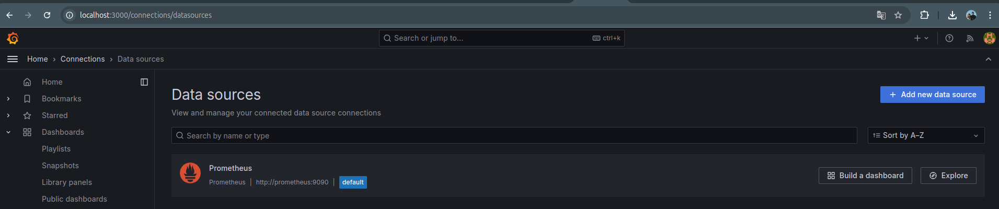
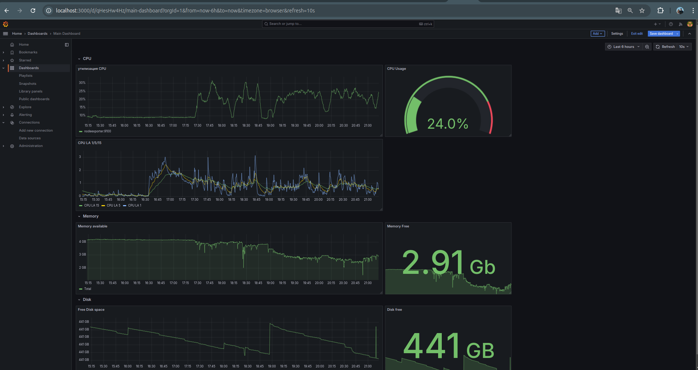
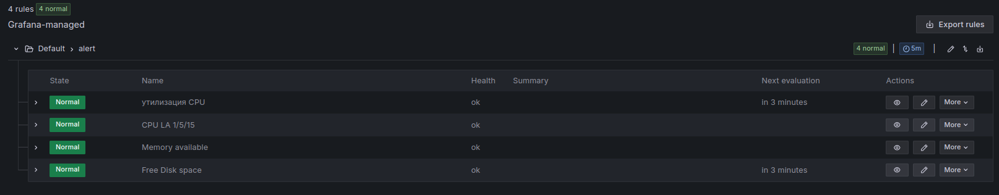

### Установка, настройка
Использовал базовый docker-compose, добавил cadvisor и маппинг портов, чтобы был доступ из браузера к prometheus и nodeexporter, версии изменил на последние.  
  
### Dashboard
Запросы:
- утилизация CPU для nodeexporter (в процентах, 100-idle):  

`(1 - avg(rate(node_cpu_seconds_total{job="nodeexporter", mode="idle"}[5m])) by (instance)) * 100`

- CPULA 1/5/15:  

`node_load1`, `node_load5`, `node_load15`

- количество свободной оперативной памяти:  

`node_memory_MemAvailable_byte`

- количество места на файловой системе:  

`node_filesystem_avail_bytes{fstype!~"tmpfs|udev", mountpoint="/"}`

### Alerts

### JSON model
[json model](dashboard.json)
